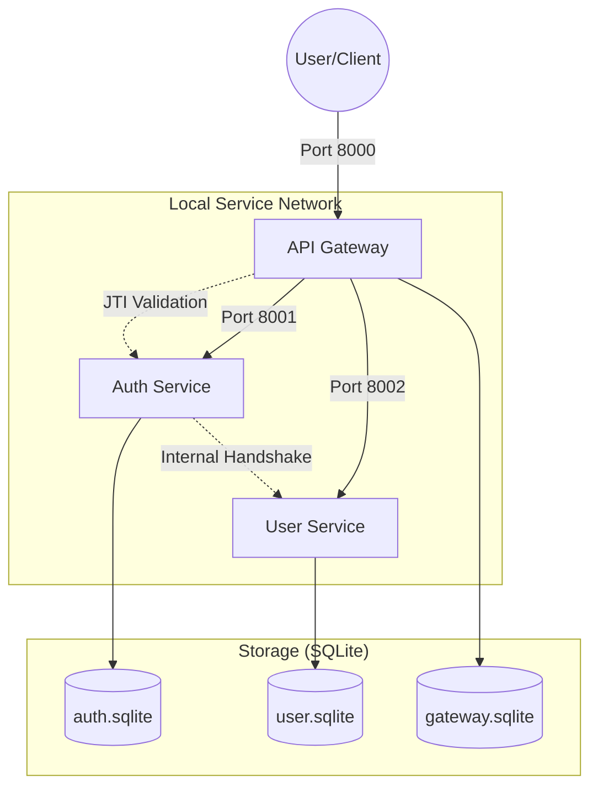

# Ecommerce Microservices Ecosystem: Hardened Identity & Security

A Laravel-based microservices architecture designed with a "Secure-by-Design" approach. This ecosystem features a centralized API Gateway, robust session management with instant revocation, and automated audit logging.

## 🏗 Architecture Overview



## 🔐 Key Hardened Features

| Feature | Description | Implementation |
| :--- | :--- | :--- |
| **Instant Revocation** | JTI (JWT ID) validation handshake on every request. | Gateway + Auth Service |
| **Session Tracking** | Active session monitoring and manual device revocation. | Auth Service |
| **Audit Logging** | Native Eloquent events tracking all User/RBAC changes. | User Service |
| **Gateway Proxy** | Dynamic proxying with header sanitization and spoof protection. | API Gateway |
| **Internal Guard** | All microservices require a `GATEWAY_SECRET` for access. | Multi-service Middleware |
| **RBAC Security** | Decoupled role assignment to prevent privilege escalation. | User Service |

---

## 🚀 Getting Started

### 1. Prerequisites
- PHP 8.2+
- Composer
- SQLite3

### 2. Environment Configuration
Ensure all services share the same `JWT_SECRET` and `GATEWAY_SECRET`.

| Service | Port | Database |
| :--- | :--- | :--- |
| **API Gateway** | 8000 | `database/database.sqlite` |
| **Auth Service** | 8001 | `database/database.sqlite` |
| **User Service** | 8002 | `database/database.sqlite` |

### 3. Quick Start (Standardized)
Run the following in each service directory:
```bash
composer install
php artisan migrate:fresh --seed
php artisan serve --port=<PORT>
```

---

## 📖 Unified API Reference (The Gateway Entry Points)

All requests should target **`http://127.0.0.1:8000/api`**.

### Authentication & Sessions (Auth Service)
| Method | Endpoint | Description | Auth Required |
| :--- | :--- | :--- | :--- |
| `POST` | `/auth/register` | Register a new account | No |
| `POST` | `/auth/login` | Login & receive JWT | No |
| `POST` | `/auth/logout` | Revoke current session | Yes |
| `GET` | `/auth/sessions` | List all active sessions | Yes |
| `DELETE`| `/auth/sessions/{id}` | Revoke a specific session | Yes |
| `GET` | `/auth/history` | View login history | Yes |

### User & RBAC Management (User Service)
| Method | Endpoint | Description | Permission Required |
| :--- | :--- | :--- | :--- |
| `GET` | `/users` | List all users | `user-list` |
| `POST` | `/roles` | Create a new RBAC role | `role-create` |
| `POST` | `/permissions` | Create a new permission | `permission-create` |
| `POST` | `/users/{id}/roles`| Assign roles to user | `role-assign` |

---

## 🛠 How to Use (Walkthrough)

### 1. Register & Login
```bash
# Register
curl -X POST http://127.0.0.1:8000/api/auth/register \
     -H "Content-Type: application/json" \
     -d '{"name": "John Doe", "email": "john@example.com", "password": "password123", "password_confirmation": "password123"}'

# Login
# Capture the 'token' from the response
curl -X POST http://127.0.0.1:8000/api/auth/login \
     -H "Content-Type: application/json" \
     -d '{"email": "john@example.com", "password": "password123"}'
```

### 2. Access Protected Resource
```bash
# Use the token from step 1
curl -X GET http://127.0.0.1:8000/api/auth/me \
     -H "Authorization: Bearer <YOUR_TOKEN>"
```

### 3. Revoke a Session
```bash
# Get your active sessions
curl -X GET http://127.0.0.1:8000/api/auth/sessions \
     -H "Authorization: Bearer <YOUR_TOKEN>"

# Revoke a session ID (e.g., ID 5)
curl -X DELETE http://127.0.0.1:8000/api/auth/sessions/5 \
     -H "Authorization: Bearer <YOUR_TOKEN>"
```

### 4. Admin: Create a Role
```bash
# Login as Admin (Default: admin@example.com / admin123)
curl -X POST http://127.0.0.1:8000/api/roles \
     -H "Authorization: Bearer <ADMIN_TOKEN>" \
     -d '{"name": "Editor"}'
```

---

## 🛡 Security Workflows

### Session Revocation Handshake
1. Client sends request to **Gateway** with JWT.
2. Gateway extracts `jti` (JWT ID) from payload.
3. Gateway calls **Auth Service** `/auth/validate` to check if `jti` is revoked.
4. If valid, Gateway forwards request to target Microservice with injected `X-User-Id` headers.

### Automated Auditing
- Every `save()`, `update()`, or `delete()` on the `User` model in the **User Service** triggers a background audit log entry.
- Audit logs capture: Who (User ID), What (Old/New values), Where (IP Address), and When.
